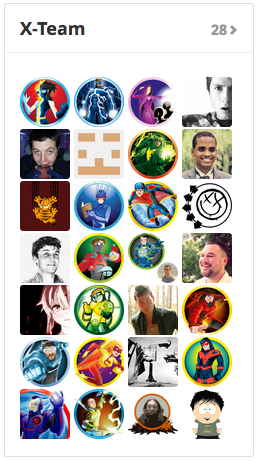
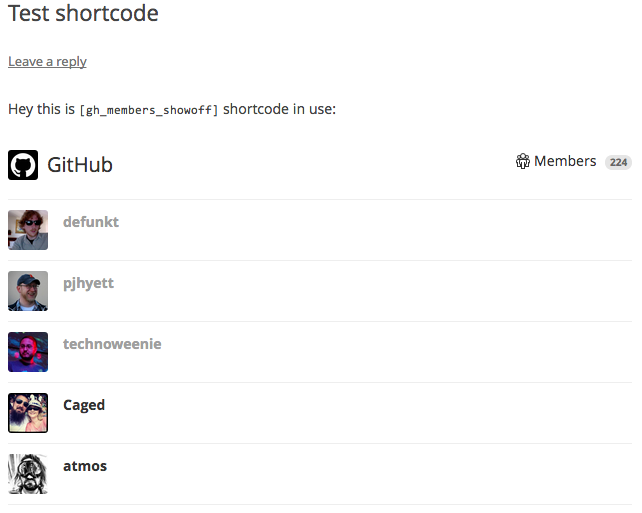

<!-- DO NOT EDIT THIS FILE; it is auto-generated from readme.txt -->
# GitHub Members Show-off

Plugin extension for GitHub API plugin for showing off GitHub org members via widget, shortcode, or hook.

**Contributors:** [akeda](http://profiles.wordpress.org/akeda)  
**Tags:** [github](http://wordpress.org/plugins/tags/github), [members](http://wordpress.org/plugins/tags/members), [org](http://wordpress.org/plugins/tags/org), [widget](http://wordpress.org/plugins/tags/widget), [shortcode](http://wordpress.org/plugins/tags/shortcode), [hook](http://wordpress.org/plugins/tags/hook)  
**Requires at least:** 3.6  
**Tested up to:** 3.9  
**Stable tag:** trunk (master)  
**License:** [GPLv2 or later](http://www.gnu.org/licenses/gpl-2.0.html)  
**Donate link:** http://goo.gl/DELyuR  

## Description ##

The widget appearance mimics the members box in GitHub org page. You just simply enter GitHub organization for the widget to show off the GitHub org members in a widget. There's filter `gh_members_showoff_widget_view_path` to change view path of the widget.

To use the shortcode, use `[gh_members_showoff org="Automattic" limit="10" order_username="asc"]`. The required attribute is `org`, the rest is optional. This will render member listing of specified org. You can change the view path of rendered member listing via `gh_members_showoff_shortcode_view_path` filter.

If you want to display member listing via plugin or theme, you can use:

```
<?php do_action( 'gh_members_showoff', array( 'org' => 'GitHub' ) ); ?>
```

The same attributes on shortcode apply too.

This plugin depends on [GitHub API](http://wordpress.org/plugins/github-api/) plugin. Make sure to install and activate that first.

**Development of this plugin is done on [GitHub](https://github.com/gedex/wp-gh-members-showoff). Pull requests are always welcome**.

## Installation ##

1. This plugin depends on **GitHub API** plugin, so make sure it's installed and activated.
1. Upload **GitHub Members Show-off** plugin to your blog's `wp-content/plugins/` directory and activate.

## Screenshots ##

### Widget instance



### Rendered shortcode



## Changelog ##

### 0.1.0 ###
Initial release


